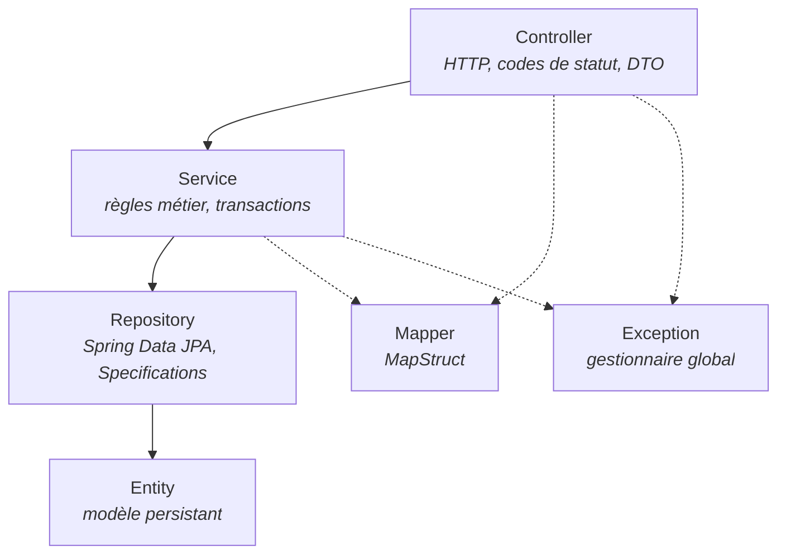

# biblio1-api
[](https://github.com/Japha-Fomen/biblio1-api/actions/workflows/ci.yml)
deployment link: https://biblio1-api.onrender.com

[](https://github.com/Japha-Fomen/biblio1-api/actions/workflows/ci.yml)

API REST de gestion de bibliothèque écrite en **Java 21** et **Spring Boot 4.1**, conteneurisée et déployée.

**Service en ligne : [biblio1-api.onrender.com](https://biblio1-api.onrender.com)**
*Hébergement gratuit : le premier appel après une période d'inactivité peut prendre jusqu'à une minute, le temps que l'instance redémarre. La base est en mémoire et repart vide à chaque redémarrage.*

Projet d'apprentissage construit seul, de bout en bout : modèle JPA, couche de service portant les règles métier, contrôleurs REST, validation des entrées, gestion centralisée des erreurs, tests automatisés, intégration continue et déploiement par conteneur.

> **État du projet : étape 1 sur 3.**
> Cette version met en place une **architecture en couches** classique (`Controller → Service → Repository → Entity`). C'est volontairement le point de départ. La suite est décrite dans la [feuille de route](#feuille-de-route).

---

## Sommaire

- [Feuille de route](#feuille-de-route)
- [Pile technique](#pile-technique)
- [Architecture actuelle](#architecture-actuelle)
- [Modèle de domaine](#modèle-de-domaine)
- [Démarrage](#démarrage)
- [Configuration](#configuration)
- [Endpoints](#endpoints)
- [Tests](#tests)
- [Intégration continue et déploiement](#intégration-continue-et-déploiement)
- [Conventions de code](#conventions-de-code)
- [Limites connues](#limites-connues)
- [English summary](#english-summary)

---

## Feuille de route

Le projet sert de support à un apprentissage progressif de l'écosystème Spring. Chaque étape est une refonte assumée de la précédente, pas un ajout de fonctionnalités.

### Étape 1 — Architecture en couches *(actuelle)*

Découpage technique horizontal. Les entités JPA traversent l'application et les règles métier vivent dans les services. Objectif : maîtriser Spring Boot, Spring Data JPA, la validation, le mapping DTO, la configuration par profils, les tests automatisés et la livraison.

### Étape 2 — Modèle domaine / service *(à venir)*

Passage à un découpage vertical par domaine métier. Le modèle de domaine devient indépendant de JPA, les règles quittent les services applicatifs pour les objets métier, et la persistance passe derrière des interfaces. Objectif : inverser la dépendance entre le métier et l'infrastructure.

### Étape 3 — Microservices *(à venir)*

Décomposition en services autonomes — catalogue, membres, emprunts — avec base de données par service, communication inter-services, configuration distribuée et découverte de services via Spring Cloud.

---

## Pile technique

| Domaine | Choix |
|---|---|
| Langage | Java 21 |
| Framework | Spring Boot 4.1.0 |
| Web | Spring Web MVC |
| Persistance | Spring Data JPA, Hibernate, JPA Specifications |
| Base de données | H2 en mémoire (dev, test), PostgreSQL prévu (prod) |
| Validation | Jakarta Bean Validation |
| Mapping | MapStruct 1.5.5 |
| Supervision | Spring Boot Actuator |
| Build | Maven (wrapper inclus) |
| Conteneurisation | Docker, image en deux étapes |
| Intégration continue | GitHub Actions |
| Hébergement | Render |

---

## Architecture actuelle



```
src/main/java/com/example/biblio1_api
├── Config/        ProprietesBiblio — configuration métier typée
├── Controller/    Auteur, Livre, Membre, Emprunt
├── Dto/           requêtes de création et de mise à jour, réponses, projections, ErrorResponse
├── Entity/        Auteur, Livre, Membre, Emprunt + énumérations Genre, StatutEmprunt
├── Exception/     RessourceIntrouvableException, ConflitMetierException, GlobalExceptionHandler
├── Mapper/        mappers MapStruct générés à la compilation
├── Repository/    dépôts Spring Data + LivreSpecification (recherche dynamique)
└── Service/       Auteur, Livre, Membre, Emprunt, RechercheLivre
```

---

## Modèle de domaine

| Entité | Rôle | Relations |
|---|---|---|
| `Auteur` | Auteur d'un ou plusieurs livres | 1 — N `Livre` |
| `Livre` | Ouvrage du catalogue, identifié par un ISBN unique | N — 1 `Auteur`, 1 — N `Emprunt` |
| `Membre` | Personne inscrite, identifiée par un courriel unique | 1 — N `Emprunt` |
| `Emprunt` | Prêt d'un livre à un membre, avec date de retour et statut | N — 1 `Livre`, N — 1 `Membre` |

Énumérations : `Genre` et `StatutEmprunt`.

Les règles de prêt sont externalisées dans la configuration et injectées via `ProprietesBiblio` : nombre maximal d'emprunts simultanés, durée du prêt, nombre d'exemplaires à l'enregistrement, pénalités par type de membre.

---

## Démarrage

### Prérequis

- JDK 21
- Aucune installation de Maven : le wrapper est fourni

### Lancer l'application

```bash
git clone https://github.com/Japha-Fomen/biblio1-api.git
cd biblio1-api/biblio1-api

./mvnw spring-boot:run -Dspring-boot.run.profiles=dev
```

Sous Windows, remplacer `./mvnw` par `mvnw.cmd`.

### Lancer par conteneur

Depuis la racine du dépôt :

```bash
docker build -f biblio1-api/Dockerfile -t biblio1-api .
docker run -p 8080:8080 -e SPRING_PROFILES_ACTIVE=dev biblio1-api
```

### Vérifier que le service répond

```bash
curl http://localhost:8091/actuator/health
```

---

## Configuration

Trois profils sont définis dans `src/main/resources`. En déploiement, le profil actif est imposé par la variable d'environnement `SPRING_PROFILES_ACTIVE`, qui l'emporte sur le fichier.

| Profil | Base de données | Schéma | Port |
|---|---|---|---|
| `dev` | H2 en mémoire, console activée, SQL journalisé | `create-drop` | 8091 |
| `test` | H2 en mémoire isolée | `create-drop` | aléatoire |
| `prod` | PostgreSQL via `DB_URL`, `DB_USERNAME`, `DB_PASSWORD` | `none` | fourni par la plateforme |

Paramètres métier :

```yaml
biblio1:
  emprunt:
    maxiSimultanes: 2
    DureeJours: 30
  enregistrementLivre:
    nombreExemplaire: 1
  penalite:
    etudiant: 1.0
    standard: 2.0
```

---

## Endpoints

Base locale : `http://localhost:8091` — en ligne : `https://biblio1-api.onrender.com`

### Auteurs

| Méthode | Chemin | Description |
|---|---|---|
| `POST` | `/api/auteurs` | Crée un auteur. Retourne `201` avec l'en-tête `Location` |
| `GET` | `/api/auteurs?page=&size=` | Liste paginée |
| `GET` | `/api/auteurs/{id}` | Détail d'un auteur |
| `GET` | `/api/auteurs/par-livre/{livreId}` | Auteur d'un livre donné |
| `PATCH` | `/api/auteurs/{id}` | Mise à jour partielle |
| `DELETE` | `/api/auteurs/{id}` | Suppression |

### Livres

| Méthode | Chemin | Description |
|---|---|---|
| `POST` | `/api/livres` | Crée un livre |
| `GET` | `/api/livres?page=&size=&sort=` | Liste paginée et triable |
| `GET` | `/api/livres?titre=` | Recherche dynamique par critères |
| `GET` | `/api/livres/{id}` | Détail d'un livre |
| `GET` | `/api/livres/isbn/{isbn}` | Recherche par ISBN |
| `PATCH` | `/api/livres/{id}` | Mise à jour partielle |
| `DELETE` | `/api/livres/{id}` | Suppression |

### Membres

| Méthode | Chemin | Description |
|---|---|---|
| `POST` | `/api/membres` | Crée un membre |
| `GET` | `/api/membres?page=&size=` | Liste paginée |
| `GET` | `/api/membres/{id}` | Détail d'un membre |
| `GET` | `/api/membres/par-email/{email}` | Recherche par courriel |
| `GET` | `/api/membres/{id}/emprunts/nombre` | Nombre d'emprunts en cours |
| `PATCH` | `/api/membres/{id}` | Mise à jour partielle |
| `DELETE` | `/api/membres/{id}` | Suppression |

### Emprunts

| Méthode | Chemin | Description |
|---|---|---|
| `POST` | `/api/emprunts` | Enregistre un emprunt |
| `GET` | `/api/emprunts/{membreId}/emprunts` | Emprunts d'un membre |
| `POST` | `/api/emprunts/{id}/retour` | Enregistre le retour d'un livre |

### Supervision

| Méthode | Chemin | Description |
|---|---|---|
| `GET` | `/actuator/health` | État de l'application |

### Format des erreurs

Toute erreur passe par un `@RestControllerAdvice` et sort dans un format unique :

```json
{
  "timestamp": "2026-10-10T13:02:41.882Z",
  "status": 400,
  "message": "La requête contient 2 champs invalides.",
  "path": "/api/livres",
  "erreurs": {
    "isbn": "doit contenir 13 chiffres",
    "nombreExemplaires": "doit être strictement positif"
  }
}
```

`404` pour une ressource absente, `409` pour un conflit métier ou une contrainte d'unicité, `400` pour une entrée invalide avec le détail par champ.

---

## Tests

Une collection Postman est versionnée dans le dépôt :

```
biblio1-api/postman/biblio1-api.postman_collection.json
```

Elle contient **47 requêtes** organisées en huit dossiers, avec assertions sur les codes de statut et capture des identifiants créés dans des variables de collection. Elle couvre :

- le flux nominal sur les quatre ressources ;
- la pagination, le tri et la recherche par critères ;
- les cas de validation rejetée (champs obligatoires, formats, contraintes de taille) ;
- les conflits métier (ISBN, courriel ou code d'auteur déjà utilisé, plafond d'emprunts atteint, retour d'un emprunt déjà clôturé) ;
- le scénario complet emprunt puis retour ;
- une phase de nettoyage à lancer en dernier.

**Import :** Postman → *Import* → le fichier JSON. Régler la variable `baseUrl` sur l'adresse voulue, sans guillemets ni barre oblique finale. Lancer l'application avec le profil `dev`, puis dérouler les dossiers dans l'ordre numéroté.

La couverture par tests JUnit est le prochain chantier ; seul le test de démarrage de contexte généré par Spring Initializr est présent à ce jour.

---

## Intégration continue et déploiement

Un pipeline GitHub Actions, défini dans `.github/workflows/ci.yml`, se déclenche à chaque poussée sur `main` et sur chaque pull request : installation du JDK 21, compilation, exécution des tests, puis conservation du JAR produit comme artefact.

Le déploiement passe par une image Docker en deux étapes. La première compile avec Maven et un JDK complet, la seconde ne conserve que le JAR sur un JRE Alpine, ce qui ramène l'image autour de 200 Mo. Le service est hébergé sur Render et écoute le port fourni par la plateforme.

---

## Conventions de code

- **Un DTO par intention.** Requête de création, requête de mise à jour et réponse sont des types distincts. Les DTO de mise à jour n'imposent aucun champ obligatoire, ce qui rend `PATCH` réellement partiel.
- **Projections légères** pour les vues en liste, afin de ne pas exposer l'entité complète.
- **Validation aux frontières.** Toute entrée passe par Jakarta Bean Validation ; aucune vérification de format ne descend dans le service.
- **Exceptions métier dédiées**, traduites en codes HTTP par un gestionnaire global unique.
- **Sémantique HTTP respectée** : `201` avec en-tête `Location` à la création, `204` à la suppression, `404` pour une ressource absente, `409` pour un conflit.
- **Configuration externalisée** : aucune valeur métier codée en dur dans le code.
- Nommage du domaine en français, cohérent d'un bout à l'autre du projet.

---

## Limites connues

Points identifiés et assumés à ce stade :

- **Pas de couverture JUnit.** Les tests automatisés passent aujourd'hui par la collection Postman. L'ajout de tests unitaires sur les services et de tests d'intégration sur les contrôleurs est le prochain chantier.
- **Pas de couche de sécurité** : ni authentification ni autorisation. Prévu après l'étape 2.
- **Pas de documentation OpenAPI générée.** L'ajout de springdoc est prévu.
- **Base en mémoire en déploiement** : les données repartent de zéro à chaque redémarrage de l'instance.
- **Quelques contraintes de validation à revoir** sur les DTO de livre, où des annotations sont posées sur des types qui ne les acceptent pas.

---

## English summary

`biblio1-api` is a library management REST API built with **Java 21** and **Spring Boot 4.1**: JPA domain model, service layer holding the lending rules, REST controllers with paginated, sortable and criteria-based queries, per-operation DTOs with Bean Validation, MapStruct mapping, a global exception handler returning structured JSON errors, three configuration profiles and an Actuator health endpoint. A versioned Postman collection of 47 automated requests covers the nominal flow, validation failures, business conflicts and the full borrow-and-return scenario. A GitHub Actions pipeline builds and tests on every push, and the service is containerized with a multi-stage Docker build and deployed live.

This is **step 1 of 3**: a conventional layered architecture. Step 2 moves the codebase to a domain-oriented model where the business layer no longer depends on JPA; step 3 decomposes it into Spring Cloud microservices. The domain vocabulary is intentionally in French.

---

## Auteur

**Rhodian Japha Fomen** — [github.com/Japha-Fomen](https://github.com/Japha-Fomen)
