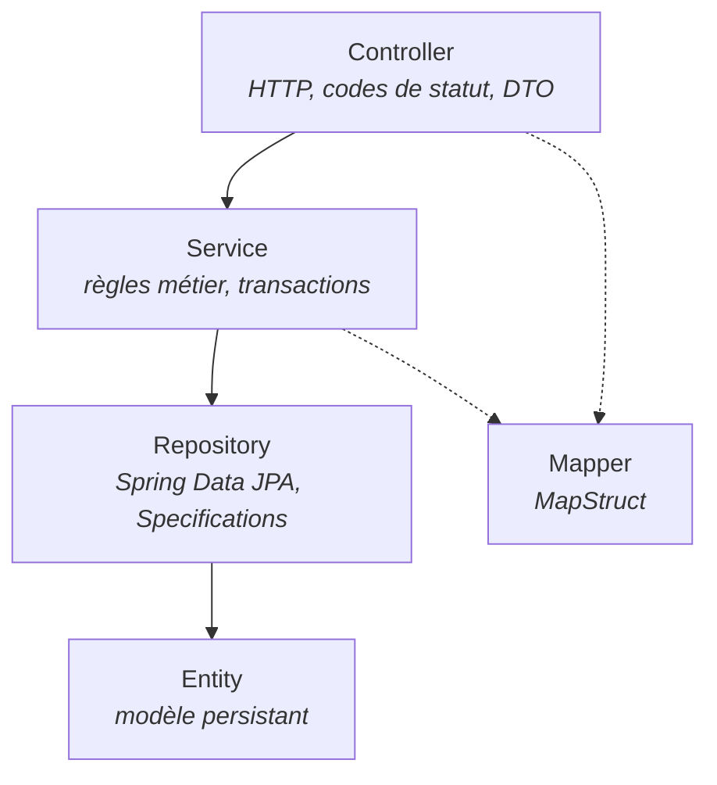

# biblio1-api
[](https://github.com/Japha-Fomen/biblio1-api/actions/workflows/ci.yml)
deployment link: https://biblio1-api.onrender.com

API REST de gestion de bibliothèque écrite en **Java 21** et **Spring Boot 4.1**.

Projet d'apprentissage construit seul, de bout en bout : modèle JPA, couche de service portant les règles métier, contrôleurs REST, validation des entrées, mapping DTO et configuration par profils.

> **État du projet : étape 1 sur 3.**
> Cette version met en place une **architecture en couches** classique (`Controller → Service → Repository → Entity`). C'est volontairement le point de départ. La suite est décrite dans la [feuille de route](#feuille-de-route).

---

## Sommaire

- [Feuille de route](#feuille-de-route)
- [Pile technique](#pile-technique)
- [Architecture actuelle](#architecture-actuelle)
- [Modèle de domaine](#modèle-de-domaine)
- [Démarrage](#démarrage)
- [Configuration](#configuration)
- [Endpoints](#endpoints)
- [Tests](#tests)
- [Conventions de code](#conventions-de-code)
- [Limites connues](#limites-connues)
- [English summary](#english-summary)

---

## Feuille de route

Le projet sert de support à un apprentissage progressif de l'écosystème Spring. Chaque étape est une refonte assumée de la précédente, pas un ajout de fonctionnalités.

### Étape 1 — Architecture en couches *(actuelle)*

Découpage technique horizontal. Les entités JPA traversent l'application et les règles métier vivent dans les services. Objectif : maîtriser Spring Boot, Spring Data JPA, la validation, le mapping DTO et la configuration par profils.

### Étape 2 — Modèle domaine / service *(à venir)*

Passage à un découpage vertical par domaine métier. Le modèle de domaine devient indépendant de JPA, les règles quittent les services applicatifs pour les objets métier, et la persistance passe derrière des interfaces (ports). Objectif : inverser la dépendance entre le métier et l'infrastructure.

### Étape 3 — Microservices *(à venir)*

Décomposition en services autonomes — catalogue, membres, emprunts — avec base de données par service, communication inter-services, configuration distribuée et découverte de services via Spring Cloud. Objectif : traiter les questions de cohérence, de résilience et de déploiement indépendant.

---

## Pile technique

| Domaine | Choix |
|---|---|
| Langage | Java 21 |
| Framework | Spring Boot 4.1.0 |
| Web | Spring Web MVC |
| Persistance | Spring Data JPA, Hibernate |
| Base de données | H2 en mémoire (dev / test), PostgreSQL prévu (prod) |
| Validation | Jakarta Bean Validation |
| Mapping | MapStruct 1.5.5 |
| Supervision | Spring Boot Actuator |
| Build | Maven (wrapper inclus) |

---

## Architecture actuelle



```
src/main/java/com/example/biblio1_api
├── Config/        ProprietesBiblio — configuration métier typée
├── Controller/    Auteur, Livre, Membre, Emprunt
├── Dto/           requêtes de création, requêtes de mise à jour, réponses, projections
├── Entity/        Auteur, Livre, Membre, Emprunt + énumérations Genre, StatutEmprunt
├── Exception/     RessourceIntrouvableException, ConflitMetierException
├── Mapper/        mappers MapStruct générés à la compilation
├── Repository/    dépôts Spring Data + LivreSpecification (recherche dynamique)
└── Service/       Auteur, Livre, Membre, Emprunt, RechercheLivre
```

---

## Modèle de domaine

| Entité | Rôle | Relations |
|---|---|---|
| `Auteur` | Auteur d'un ou plusieurs livres | 1 — N `Livre` |
| `Livre` | Ouvrage du catalogue, identifié par un ISBN unique | N — 1 `Auteur`, 1 — N `Emprunt` |
| `Membre` | Personne inscrite, identifiée par un courriel unique | 1 — N `Emprunt` |
| `Emprunt` | Prêt d'un livre à un membre, avec date de retour et statut | N — 1 `Livre`, N — 1 `Membre` |

Énumérations : `Genre` (genre littéraire du livre) et `StatutEmprunt` (cycle de vie du prêt).

Les règles de prêt sont externalisées dans la configuration et injectées via `ProprietesBiblio` : nombre maximal d'emprunts simultanés, durée du prêt en jours, nombre d'exemplaires à l'enregistrement, pénalités par type de membre.

---

## Démarrage

### Prérequis

- JDK 21
- Aucune installation de Maven : le wrapper est fourni

### Lancer l'application

```bash
git clone https://github.com/Japha-Fomen/biblio1-api.git
cd biblio1-api/biblio1-api

# profil de développement, port 8091, H2 en mémoire
./mvnw spring-boot:run -Dspring-boot.run.profiles=dev
```

Sous Windows, remplacer `./mvnw` par `mvnw.cmd`.

### Vérifier que le service répond

```bash
curl http://localhost:8091/actuator/health
```

### Console H2 (profil `dev`)

`http://localhost:8091/h2-console` — JDBC URL : `jdbc:h2:mem:biblio1`

---

## Configuration

Trois profils sont définis dans `src/main/resources`.

| Profil | Base de données | Schéma | Port |
|---|---|---|---|
| `dev` | H2 en mémoire, console activée, SQL journalisé | `create-drop` | 8091 |
| `test` | H2 en mémoire isolée | `create-drop` | aléatoire (`0`) |
| `prod` | PostgreSQL via `DB_URL`, `DB_USERNAME`, `DB_PASSWORD` | `none` | `SERVER_PORT`, 8080 par défaut |

Paramètres métier (profil `test`, à reporter dans les autres profils) :

```yaml
biblio1:
  emprunt:
    maxiSimultanes: 2       # emprunts simultanés par membre
    DureeJours: 30          # durée du prêt
  enregistrementLivre:
    nombreExemplaire: 1
  penalite:
    etudiant: 1.0
    standard: 2.0
```

---

## Endpoints

Base : `http://localhost:8091`

### Auteurs

| Méthode | Chemin | Description |
|---|---|---|
| `POST` | `/api/auteur` | Crée un auteur. Retourne `201` avec l'en-tête `Location` |
| `GET` | `/api/auteur?page=&size=` | Liste paginée |
| `GET` | `/api/auteur/{id}` | Détail d'un auteur |
| `GET` | `/api/auteur/par-livre/{livreId}` | Auteur d'un livre donné |
| `PATCH` | `/api/auteur/{id}` | Mise à jour partielle |
| `DELETE` | `/api/auteur/{id}` | Suppression |

### Livres

| Méthode | Chemin | Description |
|---|---|---|
| `POST` | `/api/livres` | Crée un livre |
| `GET` | `/api/livres?page=&size=&sort=` | Liste paginée et triable |
| `GET` | `/api/livres?titre=` | Recherche dynamique par critères |
| `GET` | `/api/livres/{id}` | Détail d'un livre |
| `GET` | `/api/livres/isbn/{isbn}` | Recherche par ISBN |
| `PATCH` | `/api/livres/{id}` | Mise à jour partielle |
| `DELETE` | `/api/livres/{id}` | Suppression |

### Membres

| Méthode | Chemin | Description |
|---|---|---|
| `POST` | `/api/membre` | Crée un membre |
| `GET` | `/api/membre?page=&size=` | Liste paginée |
| `GET` | `/api/membre/{id}` | Détail d'un membre |
| `GET` | `/api/membre/par-email/{email}` | Recherche par courriel |
| `GET` | `/api/membre/{id}/emprunts/nombre` | Nombre d'emprunts en cours |
| `PATCH` | `/api/membre/{id}` | Mise à jour partielle |
| `DELETE` | `/api/membre/{id}` | Suppression |

### Emprunts

| Méthode | Chemin | Description |
|---|---|---|
| `POST` | `/api/emprunts` | Enregistre un emprunt |
| `GET` | `/api/emprunts/{membreId}/emprunts` | Emprunts d'un membre |
| `POST` | `/api/emprunts/{id}/retour` | Enregistre le retour d'un livre |

### Supervision

| Méthode | Chemin | Description |
|---|---|---|
| `GET` | `/actuator/health` | État de l'application |

---

## Tests

Une collection Postman est versionnée dans le dépôt :

```
biblio1-api/postman/biblio1-api.postman_collection.json
```

Elle contient **45 requêtes** organisées en huit dossiers, avec assertions automatiques sur les codes de statut et capture des identifiants créés dans des variables de collection. Elle couvre :

- le flux nominal sur les quatre ressources ;
- la pagination, le tri et la recherche par critères ;
- les cas de validation rejetée (champs obligatoires, formats, contraintes de taille) ;
- les conflits métier (ISBN ou courriel déjà utilisé, plafond d'emprunts atteint, retour d'un emprunt déjà clôturé) ;
- le scénario complet emprunt puis retour ;
- une phase de nettoyage à lancer en dernier.

**Import :** Postman → *Import* → le fichier JSON. La variable `baseUrl` vaut `http://localhost:8091`. Lancer l'application avec le profil `dev` avant d'exécuter la collection, puis dérouler les dossiers dans l'ordre numéroté.

La couverture par tests automatisés JUnit est le prochain chantier ; seul le test de démarrage de contexte généré par Spring Initializr est présent à ce jour.

---

## Conventions de code

- **Un DTO par intention.** Requête de création, requête de mise à jour et réponse sont des types distincts. Les DTO de mise à jour n'imposent aucun champ obligatoire, ce qui rend `PATCH` réellement partiel.
- **Projections légères** pour les vues en liste, afin de ne pas exposer l'entité complète.
- **Validation aux frontières.** Toute entrée passe par Jakarta Bean Validation ; aucune vérification de format ne descend dans le service.
- **Exceptions métier dédiées** plutôt que des retours `null` ou des booléens.
- **Sémantique HTTP respectée** : `201` avec en-tête `Location` à la création, `204` à la suppression, `404` pour une ressource absente, `409` pour un conflit.
- **Configuration externalisée** : aucune valeur métier codée en dur dans le code.
- Nommage du domaine en français, cohérent d'un bout à l'autre du projet.

---

## Limites connues

Points identifiés et assumés à ce stade, traités dans les prochaines étapes :

- **Pas de gestionnaire d'exceptions global.** `RessourceIntrouvableException` et `ConflitMetierException` existent mais ne sont pas encore interceptées par un `@RestControllerAdvice`, donc certains cas d'erreur remontent en `500` au lieu de `404` ou `409`.
- **Pas de couche de sécurité** : ni authentification ni autorisation. Prévu après l'étape 2.
- **Pas de documentation OpenAPI générée.** L'ajout de springdoc est prévu.

---

## English summary

`biblio1-api` is a library management REST API built with **Java 21** and **Spring Boot 4.1**: JPA domain model, service layer holding the lending rules, REST controllers with paginated and sortable collections, per-operation DTOs with Bean Validation, MapStruct mapping, dedicated business exceptions, three configuration profiles and an Actuator health endpoint. A versioned Postman collection of 45 automated requests covers the nominal flow, validation failures, business conflicts and the full borrow-and-return scenario.

This is **step 1 of 3**: a conventional layered architecture. Step 2 moves the codebase to a domain-oriented model where the business layer no longer depends on JPA; step 3 decomposes it into Spring Cloud microservices. The domain vocabulary is intentionally in French.

---

## Auteur

**Rhodian Japha Fomen** — [github.com/Japha-Fomen](https://github.com/Japha-Fomen)
